# 📘 Documentação Técnica — SISMOB Boilerplate

> **Público-alvo:** Estagiários e desenvolvedores júnior  
> **Stack:** NestJS · TypeScript · PostgreSQL · TypeORM · JWT · Docker · Kubernetes · GitLab CI/CD

---

## 1. Visão Geral

O **SISMOB Boilerplate** é um projeto base padronizado para criação de APIs REST no sistema de mobilidade urbana (SISMOB / SMTR). Ele já vem configurado com as principais práticas de desenvolvimento adotadas pelo time:

| Categoria | Tecnologia |
|---|---|
| Framework | NestJS 11 (Node.js + TypeScript) |
| Banco de dados | PostgreSQL 15 via TypeORM |
| Autenticação | JWT (JSON Web Token) com expiração de 8h |
| Documentação | Swagger (OpenAPI 3) |
| Containerização | Docker + Docker Compose |
| Orquestração | Kubernetes (K8s) |
| CI/CD | GitLab CI/CD |
| Testes | Jest (unitário + e2e) |

---

## 2. Estrutura de Diretórios

```
SISMOB-BOILERPLATE/
├── src/
│   ├── main.ts                   ← Ponto de entrada da aplicação
│   ├── app.module.ts             ← Módulo raiz (configura tudo)
│   ├── config/
│   │   ├── Database.ts           ← Configuração do PostgreSQL
│   │   ├── Jwt.ts                ← Configuração do JWT
│   │   └── tab_linha.sql         ← Seed de dados de linhas
│   ├── module/
│   │   └── Linha.ts              ← Módulo de Linhas (agrupa controller + service + repo)
│   ├── controller/
│   │   ├── Auth.ts               ← Endpoint POST /auth/login
│   │   └── Linha.ts              ← Endpoint GET /linhas
│   ├── service/
│   │   ├── Auth.ts               ← Lógica de autenticação
│   │   ├── Linha.ts              ← Lógica de negócio das linhas
│   │   └── Seed.ts               ← Popula banco na inicialização
│   ├── repository/
│   │   └── Linha.ts              ← Queries SQL anti-injection
│   ├── entity/
│   │   └── Linha.ts              ← Mapeamento da tabela tab_linha
│   ├── dto/
│   │   ├── Auth.ts               ← Validação do login (username + password)
│   │   └── Linha.ts              ← Validação dos filtros de busca
│   ├── guards/
│   │   └── Jwt.ts                ← Proteção de rotas com JWT
│   ├── filters/
│   │   └── all-exceptions.filter.ts ← Captura e formata todos os erros
│   ├── exceptions/
│   │   ├── Business.ts           ← Exceção base de regra de negócio (400)
│   │   ├── entity-not-found.exception.ts ← Entidade não encontrada (404)
│   │   └── entity-already-exists.exception.ts ← Duplicidade (409)
│   ├── utils/
│   │   └── Base.ts               ← Entidade base com createdAt / updatedAt
│   ├── docs/
│   │   └── Swagger.ts            ← Configuração da documentação OpenAPI
│   └── k8s/
│       ├── app-deployment.yaml   ← Deployment Kubernetes (2 réplicas)
│       └── app-service.yaml      ← Service para exposição do pod
├── .env                          ← Variáveis de ambiente (local)
├── docker-compose.yml            ← Sobe PostgreSQL + pgAdmin localmente
├── Dockerfile                    ← Imagem de produção (Node 20 Alpine)
├── .gitlab-ci.yml                ← Pipeline: build → test → deploy
└── init.sql                      ← Cria o schema 'dados_mobilidade' no boot
```

---

## 3. Arquitetura em Camadas

O NestJS segue um padrão de **arquitetura em camadas** (Layered Architecture), onde cada camada tem uma responsabilidade única.

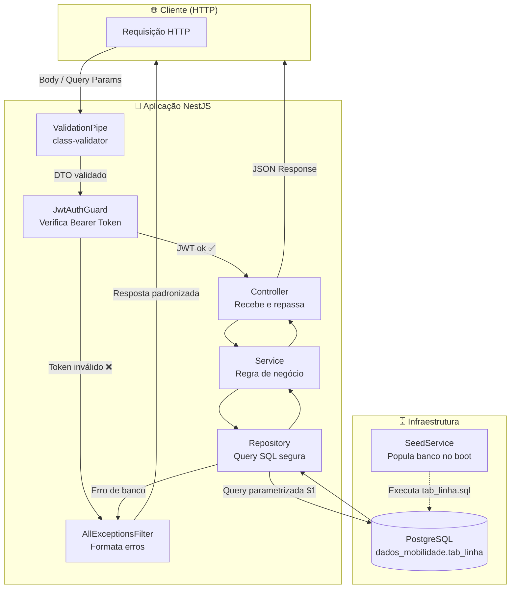

> [!NOTE]
> Cada camada **só conversa com a camada imediatamente abaixo**. O Controller nunca acessa o banco diretamente, e o Repository nunca conhece o Controller. Isso facilita testes e manutenção.

---

## 4. Fluxo Completo de uma Requisição

### 4.1 Fluxo de Login (POST /api/auth/login)

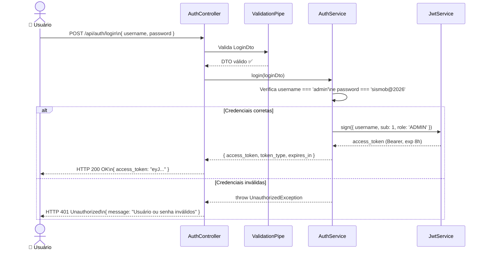

> [!IMPORTANT]
> No boilerplate, a validação de credenciais é **simulada em memória** (`admin / sismob@2026`). Em um sistema real, você consultaria o banco de dados ou um servidor de Active Directory (AD) aqui dentro do `AuthService`.

---

### 4.2 Fluxo de Consulta de Linhas (GET /api/linhas)

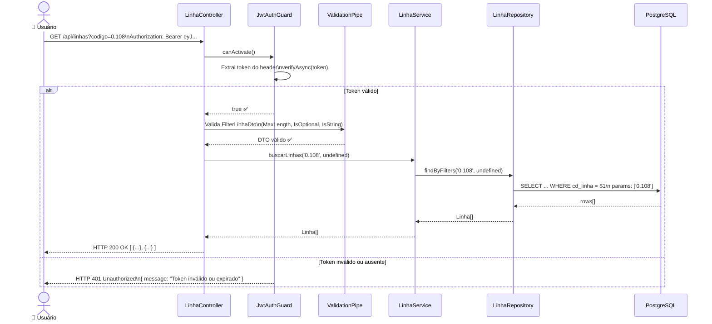

---

## 5. Módulo de Autenticação — JWT em Detalhe

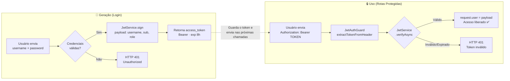

---

## 6. Proteção contra SQL Injection

O `LinhaRepository` usa **queries parametrizadas** nativas do PostgreSQL, que é a forma mais segura de montar SQL dinâmico.

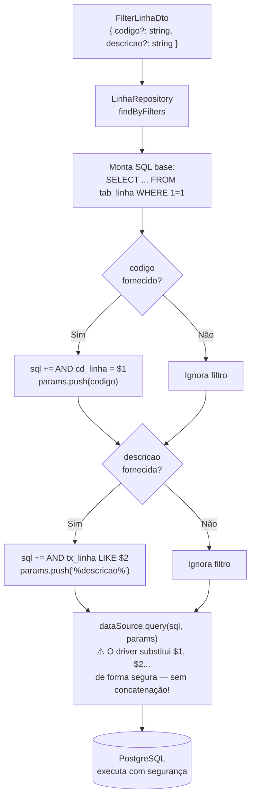

> [!WARNING]
> **Nunca** faça `sql += "AND cd_linha = '" + codigo + "'"`. Isso permite SQL Injection. Sempre use parâmetros `$1, $2, ...` e passe os valores no array separado.

---

## 7. Ciclo de Vida da Aplicação (Bootstrap)

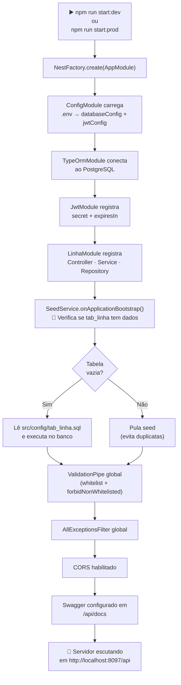

---

## 8. Hierarquia de Exceções

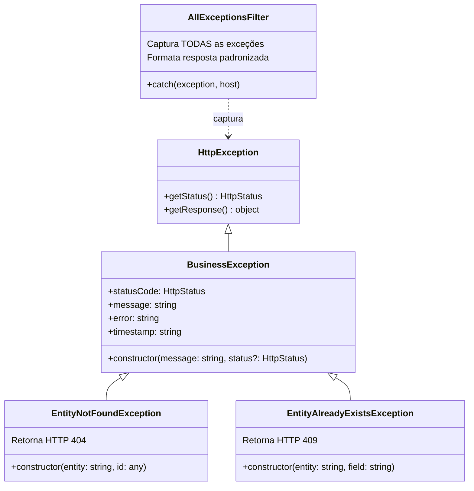

**Formato de erro padronizado** (toda exceção retorna este JSON):

```json
{
  "statusCode": 404,
  "timestamp": "2026-05-07T00:00:00.000Z",
  "path": "/api/linhas",
  "method": "GET",
  "message": "Linha com identificador '999' não foi encontrado."
}
```

---

## 9. Entidade e Banco de Dados

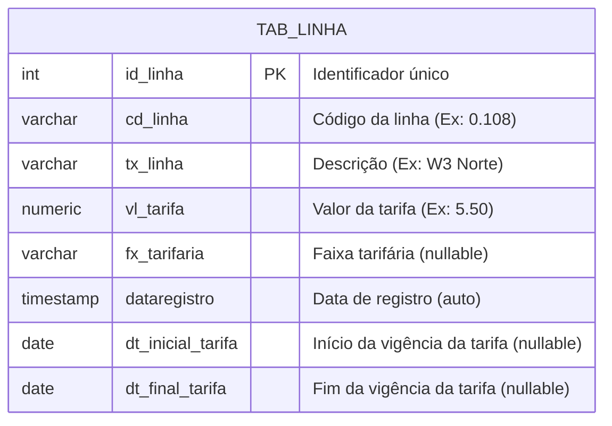

> [!NOTE]
> A tabela fica no schema `dados_mobilidade`. O schema é criado automaticamente pelo `init.sql` quando o container PostgreSQL sobe pela primeira vez.

---

## 10. Infraestrutura Local (Docker Compose)

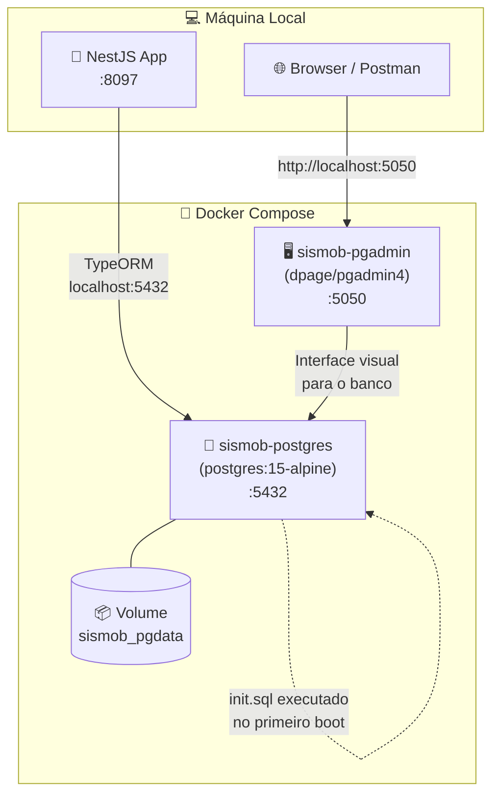

**Comandos Docker:**
```bash
# Sobe o banco + pgAdmin
docker-compose up -d

# Para tudo
docker-compose down

# Apaga dados do volume (reset total)
docker-compose down -v
```

---

## 11. Pipeline CI/CD (GitLab)

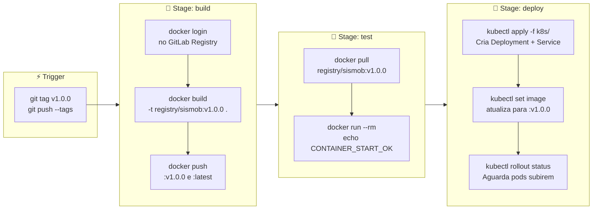

> [!IMPORTANT]
> O pipeline **só dispara com uma tag Git**. Para fazer deploy, crie uma tag (`git tag v1.x.x`) e dê push. Commits sem tag não acionam o CI/CD.

---

## 12. Arquitetura Kubernetes (Produção)

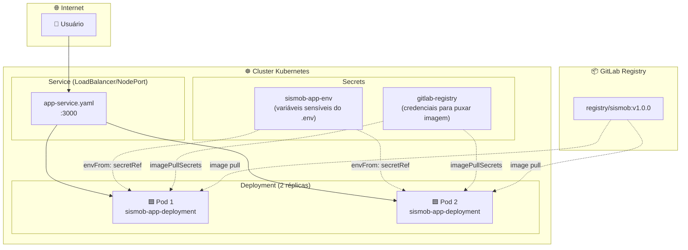

> [!TIP]
> As variáveis de ambiente (DB_PASSWORD, JWT_SECRET etc.) **nunca ficam no código**. No Kubernetes, elas são armazenadas como `Secret` e injetadas nos pods via `envFrom`.

---

## 13. Fluxo de Desenvolvimento — Como Adicionar um Novo Recurso

Seguindo o padrão do boilerplate, para criar um novo recurso (ex: `Veículo`) você deve:

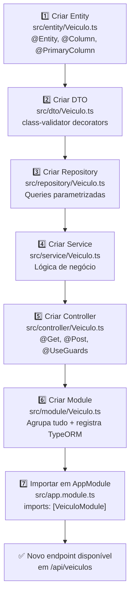

---

## 14. Variáveis de Ambiente

| Variável | Exemplo | Descrição |
|---|---|---|
| `DB_HOST` | `localhost` | Host do banco PostgreSQL |
| `DB_PORT` | `5432` | Porta do PostgreSQL |
| `DB_SERVICE_NAME` | `postgres` | Nome do banco (database) |
| `DB_USER` | `postgres` | Usuário do banco |
| `DB_PASSWORD` | `postgres` | Senha do banco |
| `DB_SYNCHRONIZE` | `true` | Sincroniza schema automaticamente (**nunca use `true` em produção!**) |
| `DB_LOGGING` | `true` | Exibe queries SQL no console |
| `JWT_SECRET` | `SISMOB_SECRET_KEY_2026` | Chave de assinatura dos tokens JWT |
| `JWT_EXPIRES_IN` | `8h` | Tempo de expiração do token |
| `APP_PREFIX` | `api` | Prefixo global das rotas (ex: `/api/linhas`) |

> [!CAUTION]
> **Nunca** faça commit do `.env` com dados de produção. O arquivo `.gitignore` já exclui o `.env` por padrão. Em produção, use Kubernetes Secrets ou variáveis de CI/CD do GitLab.

---

## 15. Endpoints da API

| Método | Rota | Autenticação | Descrição |
|---|---|---|---|
| `POST` | `/api/auth/login` | ❌ Pública | Gera um token JWT |
| `GET` | `/api/linhas` | ✅ Bearer JWT | Lista linhas com filtros opcionais |
| `GET` | `/api/docs` | ❌ Pública | Interface Swagger/OpenAPI |

**Exemplo de uso com cURL:**

```bash
# 1. Obter token
curl -X POST http://localhost:8097/api/auth/login \
  -H "Content-Type: application/json" \
  -d '{"username":"admin","password":"sismob@2026"}'

# 2. Usar token para consultar linhas
curl http://localhost:8097/api/linhas?codigo=0.108 \
  -H "Authorization: Bearer <TOKEN_AQUI>"
```

---

*Documentação gerada automaticamente a partir do código-fonte do SISMOB-BOILERPLATE.*  
*Última atualização: 2026-05-07*
